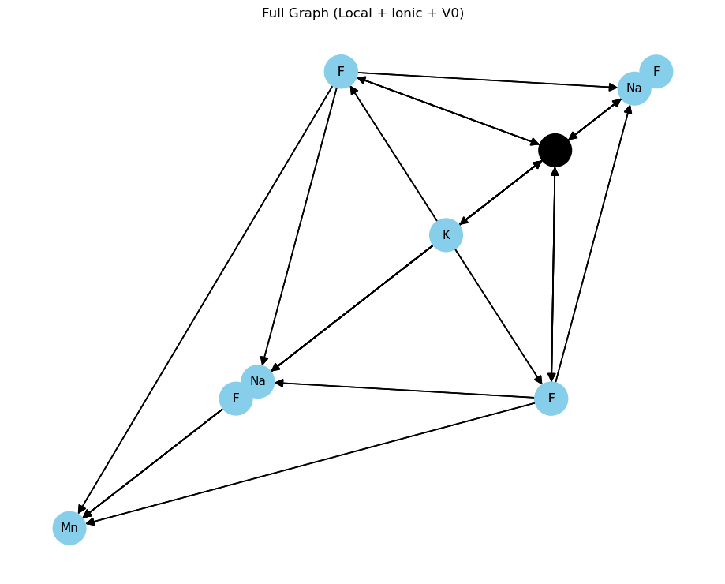
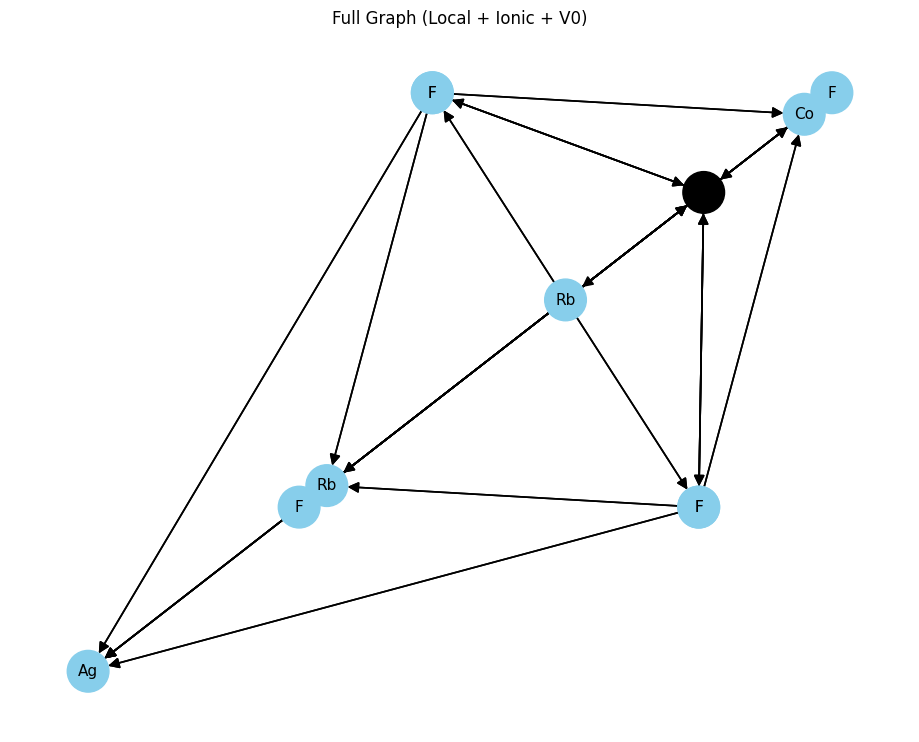

# MAD-GNN: Multi-Area Graph Neural Network for Bandgap Prediction
 📌 Overview:
 
 This project implements MAD-GNN (Multi-Area Graph Neural Network) to predict the bandgap of crystalline materials using Graph Neural Networks.
 
 🧠 Motivation:
 
Traditional GNNs treat all edges similarly. However, in materials science, different interactions 

- Local interactions (B–X)
  
- Ionic interactions (A–X / A–B)
  
- Long-range interactions
  
have distinct physical significance.

MAD-GNN addresses this by modeling these interactions separately

⚙️ Features
	Multi-branch GNN architecture
	
	Captures:
	
	Local interactions (B–X)
	
	Ionic interactions (A–X / A–B)
	
	Long-range interactions
	
	Built using PyTorch Geometric
	
	Custom graph construction from crystal structures

	
  🛠️ Tech Stack
    Python
	
	PyTorch
	
	PyTorch Geometric
	
	NumPy, Pandas
	
📁 Project Structure
│

├── data/

│   └── sample_data.csv

│

├── models/

│   └── madgnn_model.py

│

├── utils/

│   ├── graph_utils.py

│   └── preprocess.py

│

├── train.py

├── evaluate.py

├── requirements.txt

└── README.md

 📸 Graph Visualization

     🔹 Graph 1
	 

     🔹 Graph 2
	 

     🔹 Graph 3
	 

	
  📊 Results
  
  Improved prediction performance compared to baseline GNN models
  
  Evaluated using Mean Absolute Error (MAE)

  
  📊 Model Performance

| Metric            | Value |

| Test MAE (eV)      | 0.328  |

| Test RMSE (eV)     | 0.572  |

| Accuracy (±0.5 eV) | 82.87% |

| Relative Accuracy  | 80.06% | 

🧠 Attention Weights Insight

The model learns to prioritize different interaction types:

- Local interactions: **0.29**

- Ionic interactions: **0.37**
  
- Long-range interactions: **0.33**

👉 Shows model captures **physical chemistry relationships**

🔍 Sample Predictions

| True (eV) | Predicted (eV) | Error |

| 5.122     | 5.071          | 0.051 |

| 3.628     | 3.813          | 0.185 |

| 6.239     | 6.174          | 0.065 |

| 0.314     | 1.170          | 0.856 |

| 1.035     | 1.295          | 0.259 |

💡 Key Insights

- Multi-area GNN improves prediction by modeling:
  
  - Local bonds (B–X)
    
  - Ionic interactions (A–X / A–B)
    
  - Long-range effects

- Attention mechanism dynamically weights interactions

- Achieved strong accuracy with limited dataset
  
- Model struggles slightly with very low bandgap values
	
  ▶️ How to Run
  
  pip install -r requirements.txt
  
  python train.py

  python evaluate.py

> ⚡ Achieves ~0.32 eV MAE on bandgap prediction using graph modeling
  

	
  
